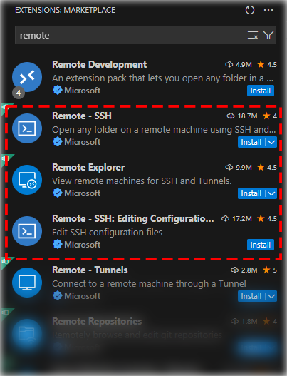
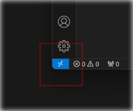
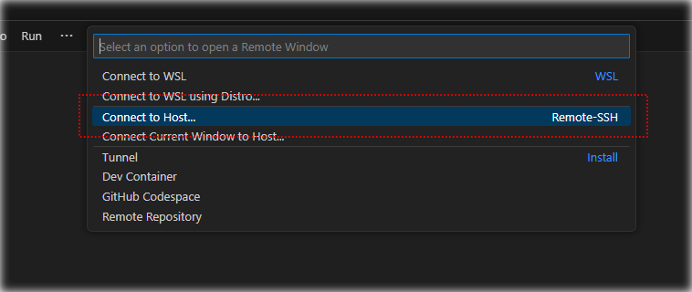
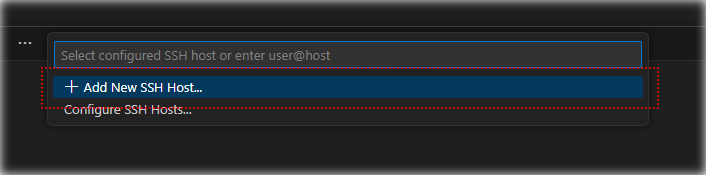
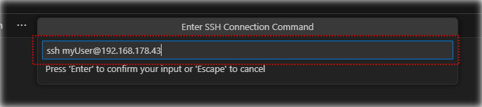
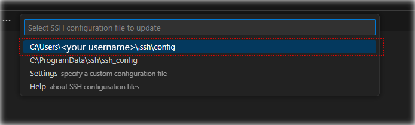
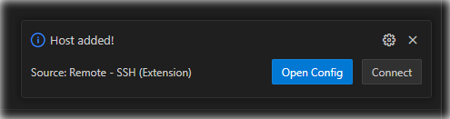
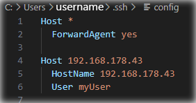
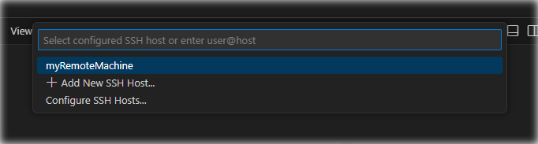

# Installation of laptop for remote work

## Overview

We will

-   install Visual Studio Code (short: `vscode`)
-   update Win32-OpenSSH (v8.6.0.0p1 ships with Windows 11, that version is buggy)
-   create an ssh-key (ed25519 is now the new standard)
-   let windows manage our keys
-   configure vscode to connect to our remote machine
    -   we use our local ssh keys to authenticate with the remote machine
    -   we use our local ssh keys to authenticate with git

To make sure every script is in its place, download [this repo](github.com/subnetz/WSL-Init/archive/master.zip) and **extract it!**

## Install Visual Studio Code

Install vscode [from here](https://code.visualstudio.com/download).

## Update Win32-OpenSSH

We need to update our Win32-OpenSSH.  
The version shipped with Windows 11 is v8.6.0.0p1  
That version does not work with _`Making local SSH Agent available on the remote`_, which we will use later.

Get the newest Beta version [from here](https://github.com/PowerShell/Win32-OpenSSH/releases).  
It does not have a UI as of writing this, so run the .msi Installer with

```bat
REM msiexec /i <path to openssh.msi> ADDLOCAL=Client
msiexec /i OpenSSH-Win64-v9.5.0.0.msi ADDLOCAL=Client
```

After installation, check that the version matches with the downloaded version by typing

```bat
where ssh
REM C:\Program Files\OpenSSH\ssh.exe
REM C:\Windows\System32\OpenSSH\ssh.exe
ssh -V
REM OpenSSH_for_Windows_9.5p1, LibreSSL 3.8.2
```

## Create ssh-key

_NOTE:_ I will use the shortcut `~` for the current user profile. It is usually located at `C:\Users\<your username>\`.  
If you use cmd, you can replace `~` with `%userprofile%`

Open cmd, type in the following command:

```bat
ssh-keygen -t ed25519 -b 4096
```

**_Please use a passphrase!_**

This will create the two files `~/.ssh/id_ed25519` and `~/.ssh/id_ed25519.pub`  
If you used another path or filename, be sure to use the correct paths in the next steps.  
The first is your private key, never share or publish this key.  
The second is the public key, which we will need to authenticate at the headless machine or git.  
You can add the public key in github or gitlab. Go to github/gitlab -> Your Profile -> SSH Keys

## Enable the ssh-agent service in Windows

This will enable the ssh-agent-service in Windows.  
Just run the `start_ssh_agent_script.bat` file.

## Add your key to Windows ssh-agent

If your key is located at `~/.ssh/id_ed25519`  
just type

```bat
ssh-add
```

into cmd. It automatically adds `~/.ssh/id_ed25519`, `~/.ssh/id_rsa`, `~/.ssh/id_dsa` and `~/.ssh/identity` to the agent.  
Type in your passphrase, it will now be tied to your Windows Login.  
You can check if it succeeded by typing in

```bat
ssh-add -l
```

##

If you have another filename, for example `~/.ssh/id_myKey` and `~/.ssh/id_myKey.pub`, type

```bat
ssh-add %userprofile%\.ssh\id_myKey
```

## Authorize your Windows machine to connect

Since we want to automatically add users while setting up the remote machine, wait for your colleagues to create their ssh keys and collect all the public keys.

The "normal" workflow would be:

To use your key for key-based ssh authentication, copy the content of your public key to  
`<remote machine>/home/<your username>/.ssh/authorized_keys`

## VSCode configuration

Install the `Remote - SSH` extension in Visual Studio Code. The plugin is published by Microsoft.  
It will also automatically download the extensions `Remote Explorer` and `Remote - SSH: Editing Configuration Files`.



Now you can use the bottom-left icon to connect to remote hosts



Click on **Connect to Host...**



Click on **Add New SSH Host...**



Add `ssh <username>@<remote server>`



Save the settings to your local user settings.  
We will edit those settings in the last step.



After connecting to the Server, select **Linux** as the operating system



You are now connected to the Server. Congratulations!

## Making local SSH Agent available on the remote

### _**This is an excerpt [from here](https://code.visualstudio.com/docs/remote/troubleshooting).**_

An SSH Agent on your local machine allows the Remote - SSH extension to connect to your chosen remote system without repeatedly prompting for a passphrase, but tools like Git that run on the remote, don't have access to your locally-unlocked private keys.

You can see this by opening the integrated terminal on the remote and running `ssh-add -l`. The command should list the unlocked keys, but instead reports an error about not being able to connect to the authentication agent. Setting `ForwardAgent yes` makes the local SSH Agent available in the remote environment, solving this problem.

You can do this by editing your `.ssh/config` file (or whatever `Remote.SSH.configFile` is set to in vscode - use the **Remote-SSH: Open SSH Configuration File...** command to be sure) and adding:

```conf
Host *
    ForwardAgent yes

```

Note that you might want to be more restrictive and only set the option for particular named hosts.

## Config example

Your config should now look like this:



You can rename `Host` to have a human-readable name when opening `Remote - SSH`:

```
Host myRemoteMachine
    HostName 172.168.178.43
    User myUser
```



##

You can either use

```
Host *
    ForwardAgent yes
```

to enable agent fowarding for every host, or enable it manually for a single host using

```
Host myRemoteMachine
    HostName 172.168.178.43
    User myUser
    ForwardAgent yes
```
